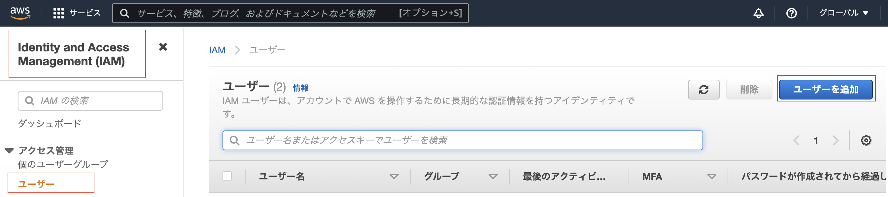
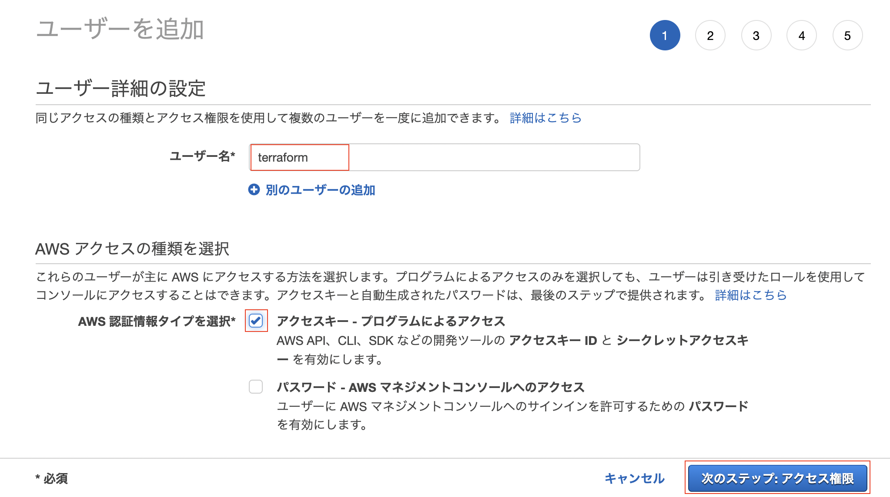
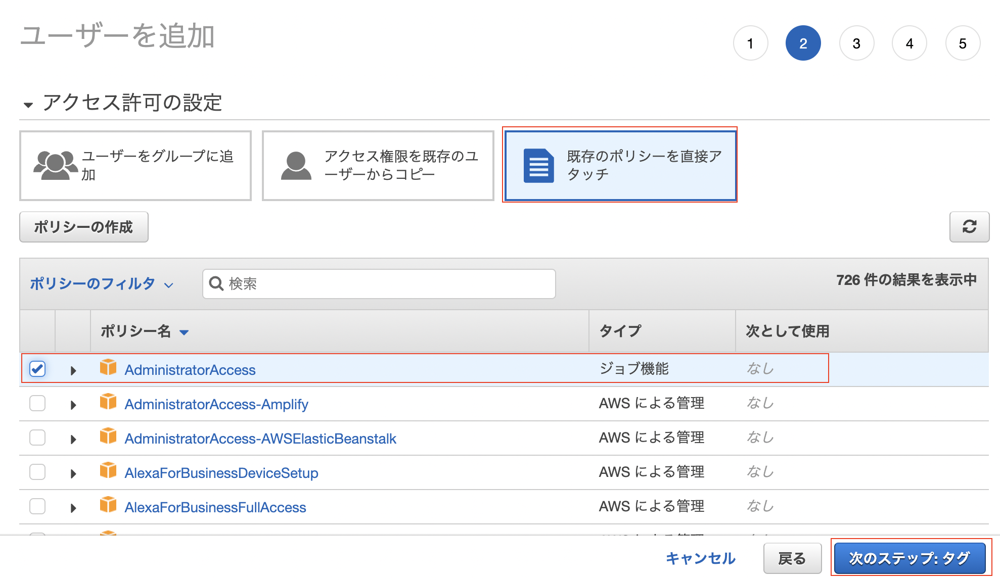
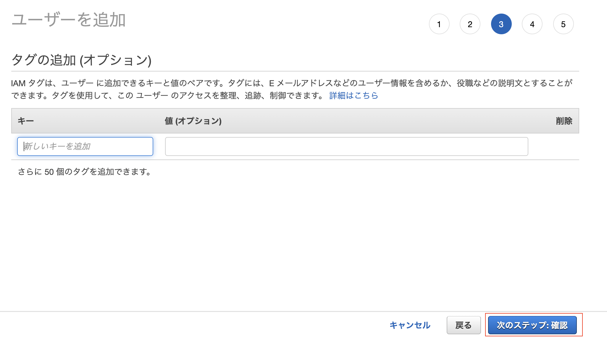
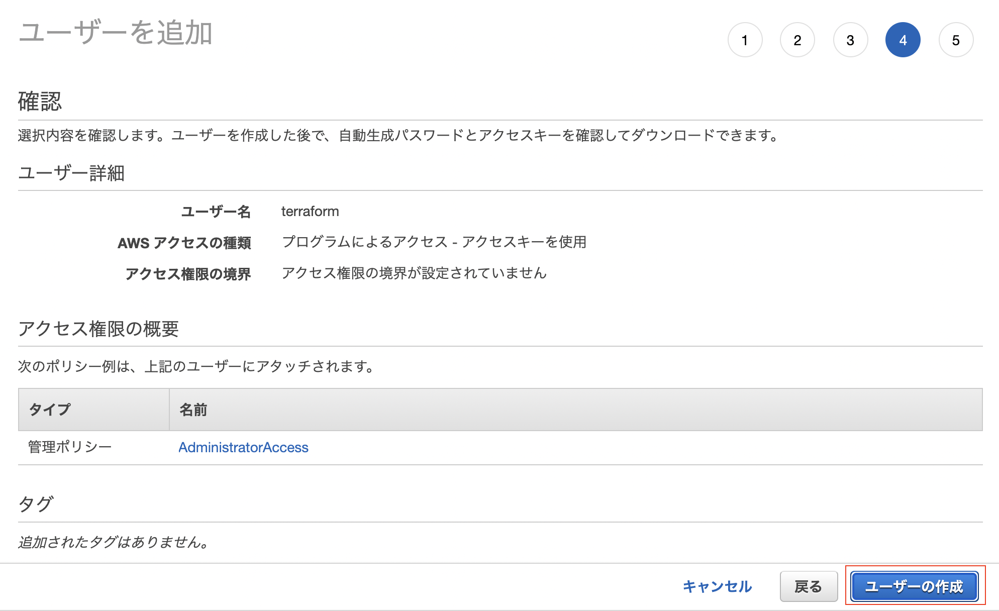
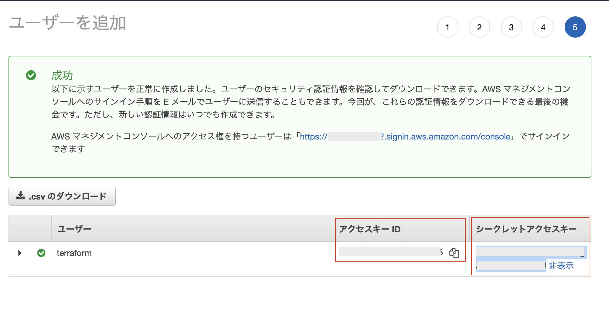

AWS Terraform
====

個人的に自宅ラボとして進めている AWS の Terraform Code

## AWS Terraform 環境準備

### 前提

- AWS Account ID 取得済み(未取得の場合は `ACCOUNT_CREATE.md` を参照)
- Terraform install 済み
- AWS 向け設定未実施

### AWS Terraform IAM ユーザの作成

Terraform ユーザを作成する

IAM > ユーザー で `ユーザーを追加` をクリック



ユーザー名に Terraform で使用するユーザー名を入力する (図では`terraform`)



アクセス許可の設定で`既存のポリシーを直接アタッチ`をクリックして`AdministratorAccess`にチェックを入れて`次のステップ`をクリック



タグの追加は不要で次へ



確認してユーザーの追加を実施



`アクセスキーID` と`シークレットアクセスキー`をコピーする



### AWS CLI Install

AWS CLI ツールをインストールする

```sh
pip3 install --user awscli
```

### 環境変数設定
AWS 向けの環境変数を設定する

IAM で Terraform ユーザーを作成した際に出力された際にコピーした`アクセスキーID`を`AWS_ACCESS_KEY_ID`, `シークレットアクセスキー`を `AWS_SECRET_ACCESS_KEY` で環境変数で設定する
デフォルトにするリージョンを`AWS_DEFAULT_REGION`として設定する
[ドキュメント](https://registry.terraform.io/providers/hashicorp/aws/latest/docs#environment-variables)

```sh
export AWS_ACCESS_KEY_ID="anaccesskey"
export AWS_SECRET_ACCESS_KEY="asecretkey"
export AWS_DEFAULT_REGION="ap-northeast-1"
```

環境変数を保存する(下記は`zsh`の場合.`bash`の場合は`.zshrc`を`.bashrc`へ書き換え)

```sh
echo "## AWS" >> ~/.zshrc
echo "export AWS_ACCESS_KEY_ID=$AWS_ACCESS_KEY_ID" >> ~/.zshrc
echo "export AWS_SECRET_ACCESS_KEY=$AWS_SECRET_ACCESS_KEY" >> ~/.zshrc
echo "export AWS_DEFAULT_REGION=$AWS_DEFAULT_REGION" >> ~/.zshrc
```

下記コマンドで`UserId`などが表示されれれば設定はうまくいっている

```sh
aws sts get-caller-identity
```


### Backend S3 作成
Terraform の State ファイルを保存する S3 を作成する

```sh:create-bucket.sh
AWS_BUCKET_NAME="tfstate-bucket"$RANDOM
AWS_LOCATION="ap-northeast-1"
aws s3api create-bucket \
--region $AWS_LOCATION \
--create-bucket-configuration LocationConstraint=$AWS_LOCATION \
--bucket $AWS_BUCKET_NAME
```

S3 のバージョニング設定を有効化する

```sh:set-bucket-versioning.sh
aws s3api put-bucket-versioning \
--bucket $AWS_BUCKET_NAME \
--versioning-configuration Status=Enabled
```

S3 の暗号化を設定する

```sh:set-bucket-encryption.sh
aws s3api put-bucket-encryption \
--bucket $AWS_BUCKET_NAME \
--server-side-encryption-configuration '{
  "Rules": [
    {
      "ApplyServerSideEncryptionByDefault": {
        "SSEAlgorithm": "AES256"
      }
    }
  ]
}'
```

S3 の公開アクセスを禁止する

```sh:set-bucket-block-publicaccess.sh
aws s3api put-public-access-block \
--bucket $AWS_BUCKET_NAME \
--public-access-block-configuration '{
  "BlockPublicAcls": true,
  "IgnorePublicAcls": true,
  "BlockPublicPolicy": true,
  "RestrictPublicBuckets": true
}'
```

## AWS Organization 設定

下記、`README.md` の設定

```sh
~/aws-terraform/env/homelab/organizations/README.md
```

## AWS SSO 設定

下記、`README.md` の設定

```sh
~/aws-terraform/env/homelab/sso/README.md
```

## 予算アラート設定

下記、`README.md` の設定

```sh
~/aws-terraform/env/homelab/cost-alert/README.md
```

## 複数 AWS Account でのクレデンシャル管理

Terraform での[クレデンシャル管理](https://registry.terraform.io/providers/hashicorp/aws/latest/docs#authentication-and-configuration)は複数あるが、
ここでは [Shared credentials files](https://docs.aws.amazon.com/cli/latest/userguide/cli-configure-files.html#cli-configure-files-where) を使用する

下記のようにクレデンシャルファイルを作成し、AWS アカウントごとに名前をつけて、
Terraform アカウントを作成 (やり方は各アカウント内で[AWS Terraform IAM ユーザの作成]と同じ) して、`aws_access_key_id` と `aws_secret_access_key` を記載する


```~/.aws/credentials
[organization]
aws_access_key_id=1111111111XXXXXXXXXX
aws_secret_access_key=11111111111111111111111111111111111/AAAA

[infra]
aws_access_key_id=1111111111YYYYYYYYYY
aws_secret_access_key=11111111111111111111111111111111111/BBBB

[service]
aws_access_key_id=1111111111ZZZZZZZZZZ
aws_secret_access_key=11111111111111111111111111111111111/CCCC
```

aws cli で指定する場合は`--profile [NAME]`で指定する

```sh
aws configure list --profile infra
```

terraform では `provider` と `backend` で `profile` で指定する (下記例)

```tf
terraform {
  required_providers {
    aws = {
      source  = "hashicorp/aws"
      version = "=4.30.0"
    }
  }
  # https://www.terraform.io/language/settings/backends/s3
  backend "s3" {
    bucket                  = "tfstate-bucketXXXXX"
    key                     = "infra-infra1-vpc"
    region                  = "ap-northeast-1"
    shared_credentials_file = "~/.aws/credentials"
    profile                 = "infra"
  }
}

# Configure the AWS Provider
provider "aws" {
  region                  = "ap-northeast-1"
  shared_credentials_file = "~/.aws/credentials"
  profile                 = "infra"
}
```

terraform 実行前に環境変数があると profile より優先されてしまうので、環境変数を消しておく

```sh
unset AWS_ACCESS_KEY_ID
unset AWS_SECRET_ACCESS_KEY
```

上記をやらないと `terraform init` 実施時にエラーが出る (TF_LOG=DEBUGでデバッグすると環境変数側が優先されていることが見える)

```txt:エラーログ
Initializing the backend...

Successfully configured the backend "s3"! Terraform will automatically
use this backend unless the backend configuration changes.
Error refreshing state: AccessDenied: Access Denied
        status code: 403, request id: xxxxxxxxxxx, host id: xxxxxxxxxxxxxxxxxxx...
```
