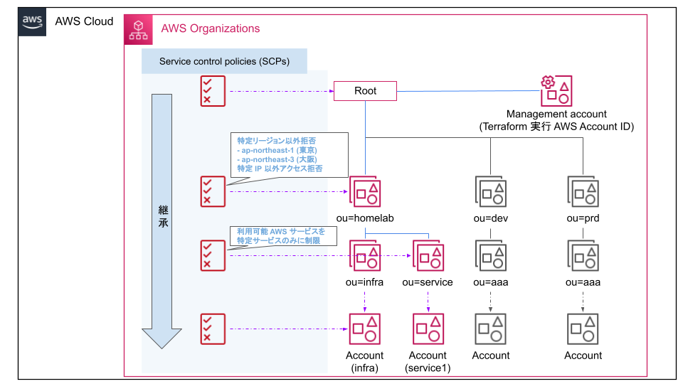
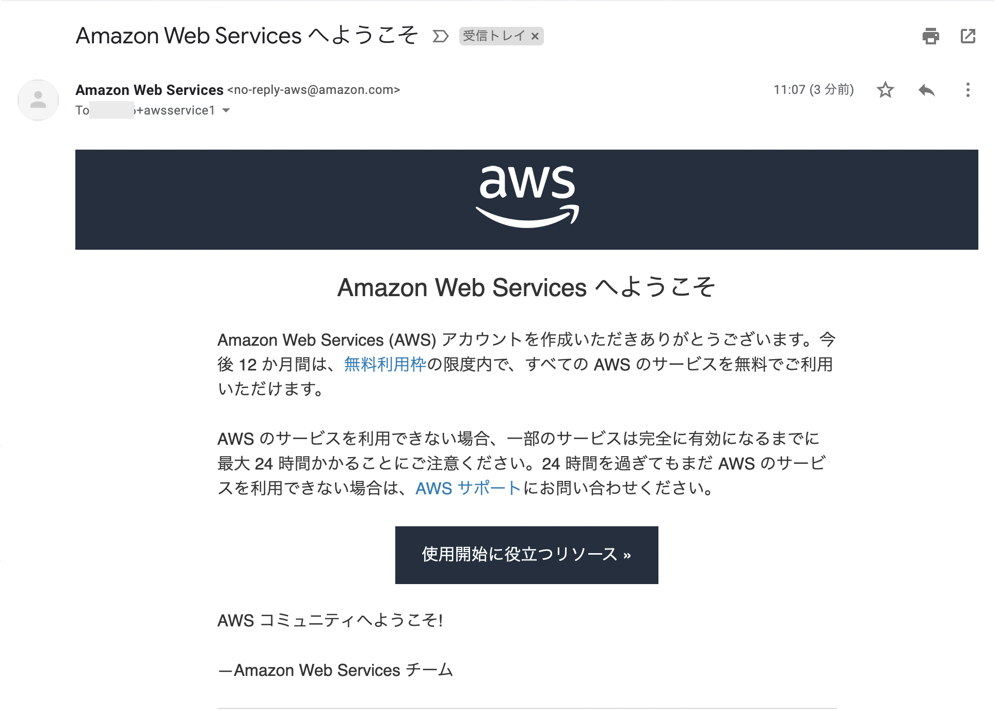
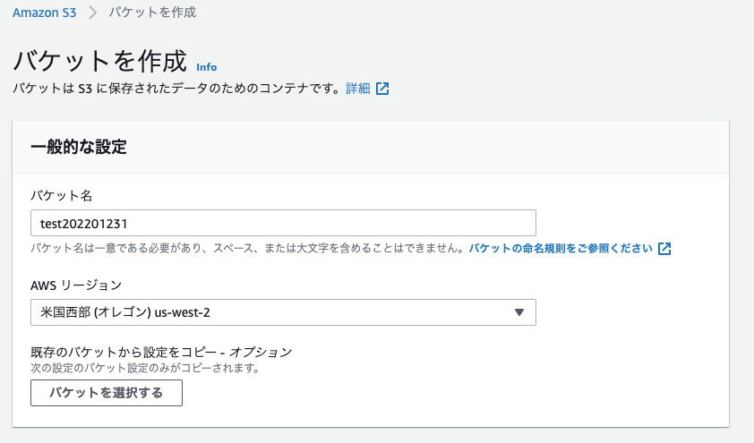

AWS Terraform Organizations
====
Organization 作成, Account 払出, SCP 設定 Terraform Code

## 概要



- ou(organization unit)
  - 2階層で作成(概要図色付きの箇所)
  - homelab / infra / service
- account
  - 2階層目の ou にアカウントを 1つずつ作成
- SCPs(Service Control Policies)
  - 設定箇所: ou=homelab (`./scp.tf`のコメント箇所変更で場所変更可能)
  - 特定リージョン以外を拒否する設定を実施
  - 設定リージョン： ap-northeast-1 (東京), ap-northeast-3 (大阪)


## 設定


### terraform.tfvars 更新
下記 tfvars を作成しパラメータを更新する

```sh
cp -p terraform.tfvars.sample terraform.tfvars
vi terraform.tfvars
```

下記コマンドで `account id` を出力可能

```sh
aws sts get-caller-identity | jq '.Account'
```

### Backend S3 の設定を更新

```sh
vi main.tf
```

下記出力したパラメータで更新

```sh
echo bucket = \"$AWS_BUCKET_NAME\"
echo region = \"$AWS_LOCATION\"
```

```sh:terraform_init
terraform init
```
### AWS Organization 有効化

```sh:terraform_apply
terraform plan -target=aws_organizations_organization.org
terraform apply -target=aws_organizations_organization.org
```

下記のようなメールが来るので `Verify your email address` をクリックする


検証がうまくいくと下記のように表示され、他の AWS アカウントを作成した組織へ招待できるようになる


### AWS OU / Account 作成

```sh:terraform_apply
cd ~/aws-terraform/env/homelab/organizations/
terraform plan
terraform apply
```

作成できると下記の通り


作成したアカウントのメールアドレス先に、下記のように払い出しメールが出る



#### パスワードリセット

払い出しアカウントでルートユーザーログイン


`パスワードをお忘れですか？`をクリックする


パスワードの回復を実施する


下記のようなメールが来るので、リンクをクリックしてパスワードリセットする


新しいパスワードを入力する


以上で、パスワード設定が完了して、払い出しアカウントへログインが可能になる

## SCP (Service Control Policies)
組織のアクセス許可設定を一元的にポリシー管理ができる SCP を設定する ([ドキュメント](https://docs.aws.amazon.com/ja_jp/organizations/latest/userguide/orgs_manage_policies_scps.html))

下記を設定

|  sid  | 内容  |  default  |
| ---- | ---- | ---- |
| RegionRestriction | 設定以外のリージョンを拒否 | ["ap-northeast-1", "ap-northeast-3", ] |

### RegionRestriction

使用可能なリージョンを制限する

#### EC2 反映表示例
設定済みリージョン : 通常と同じ表示. 作成可能


未設定リージョン : API エラーになる


#### S3 反映表示例

設定済みリージョン : 作成可能


未設定リージョン : 作成不可




