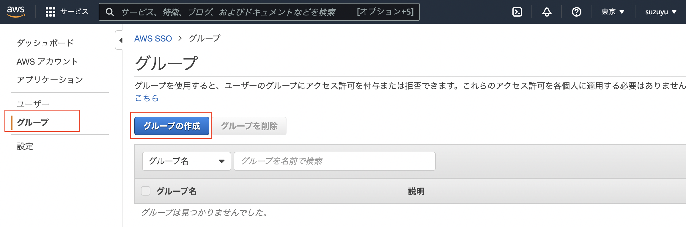
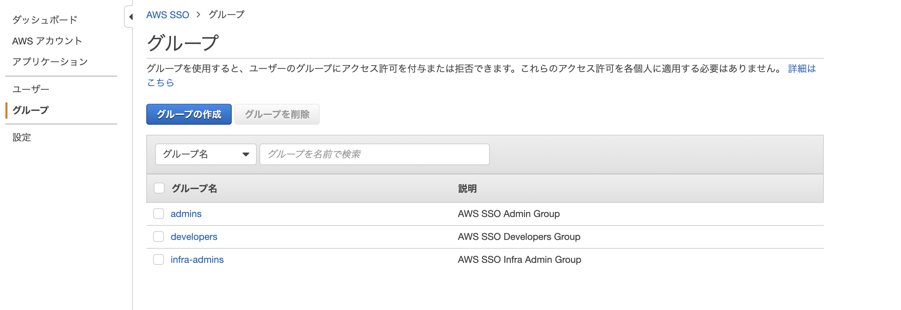

AWS Single Sign-On (SSO)
====
AWS SSO の有効化 ~ 設定 実践の個人試験内容・Terraform コード

## 概要
下図が本コード等で設定する概要図


- AWS SSO
  - ID Source
    - ID ソースは `AWS SSO` のまま使用する
  - AWS SSO ID Group
    - admins: 管理アカウント(infra,service1)に対して `AdministratorAccess` をアサインして、User: `admin1` を作成する
    - infra-admins: 管理アカウント(infra,service1)に対して `NetworkAdministrator` をアサインして、User: `infra1` を作成する
    - developers: 開発用アカウント(service1)に対して `SystemAdministrator` をアサインして、User: `dev1` を作成する
  - MFA (多要素認証)を設定して、サインイン時に登録を求める

## AWS SSO 設定

[AWS SSO ユーザーガイド](https://docs.aws.amazon.com/ja_jp/singlesignon/latest/userguide/what-is.html)

### 前提条件

AWS Organization 有効化済み (`../organizaions/` を実施済み)

### 設定区分

- 手動設定が必要
  - [AWS SSO 有効化](#AWS-SSO-の有効化) ※
  - [AWS SSO ID ソース設定](#AWS-SSO-ID-ソース-設定)
  - [AWS SSO ID ユーザー, グループ作成](#aws-sso-id-ユーザー-グループ作成)
  - [MFA 設定](#MFA-認証)
- [Terraform](#グループへの権限設定とアカウントへの紐付け-terraform)
  - 権限設定
  - アカウントへの設定

※ `../organizations/organization.tf` の `aws_service_access_principals` で `sso.amazonaws.com` を有効化している場合は不要


### AWS SSO の有効化

[AWS SSO Console](https://console.aws.amazon.com/singlesignon) を開く

`AWS SSO を有効にする`をクリックする


クリックすると有効化が始まる


30秒程度待つと有効化が完了して、下記の画面へ遷移する


<!--
### 設定内容

 -->

###  AWS SSO ID ソース 設定

`AWS SSO` > `設定` で AWS SSO の ID ソースの設定ができる (`変更`をクリックする)


本設定では、`AWS SSO` を ID ソースとしても利用するのでそのままにする

### AWS SSO ID ユーザー, グループ作成

グループを作成する

`グループ` > `グループの作成` でグループを作成する




作成が完了すると一覧に表示される




ユーザーを作成する

`ユーザー` > `ユーザーを追加` をクリック


admin1 を作成する


infra1 を作成する


dev1 を作成する


作成完了すると一覧に表示される


登録したメールアドレスへ Invitation メールが来ているのでリンクをクリックする


パスワードを設定する


### グループへの権限設定とアカウントへの紐付け (Terraform)

tfvars を作成して、設定環境の`id`を記載する <br>
(`../organizations`実施時に output された値だと、`infra_account_ids` =[`ou1-1-account1_id`, ], `service_account_ids` = 
[`ou1-2-account1_id`, ])

```sh
cp -n terraform.tfvars.sample terraform.tfvars
```

`./main.tf` の値を書き換える (下記`../organizations`と同じ設定の場合)

```sh
grep "bucket" ../organizations/main.tf 
grep "region" ../organizations/main.tf
```

```sh
vi main.tf
```

terraform 実施

```sh
terraform init
terraform plan
terraform apply
```

以上で、グループへの権限付与と、グループの AWS Account ID への紐付け完了

### ログイン確認

SSO の URL (下記) へアクセスする


ユーザー名を入力


パスワードを入力 (メールできた初回設定済みの場合)


`admin1`でログインすると 2 つのアカウントへ `AdministratorAccess` で設定されていることがわかる<br> (各 AWS Account ID の `Management console` をクリックするとログインできる)


`infra1`でログインすると 2 つのアカウントへ `NetworkAdministrator` で設定されていることがわかる


`dev1`でログインすると 1 つのアカウントへ `SystemAdministrator` で設定されていることがわかる


## MFA 認証

### MFA devices 登録

ログイン後の右上の `MFA devices` をクリックする


`Register device` をクリックする


設定方法は、別途記載

### MFA 要求設定

多要素認証の設定は、`AWS SSO` > `設定` > `多要素認証` の中の `設定` をクリックすることでできる


下記がデフォルト状態


`サインイン時に MFA デバイスを登録するよう要求する` をチェックして `変更を保存` をクリックする


上記設定変更で次回ユーザログインから MFA デバイス登録が求められるように変更された

### MFA device 登録フロー

前述の `MFA devices 登録` もしくは、`MFA 要求設定` 後に初回ログインすると、
`MFA デバイスの登録`のページになる

本記載でのテストでは `Google Authenticator`を使用したので、`認証アプリ` を選択する


登録方法が出力されるので、画面に従って実施する

iPhone などに`Google Authenticator`をインストールした後に、`Show QR code` をクリックする


`Google Authenticator` で QR コードを読み取り、登録をした後、出力される 6 桁の数字を`認証アプリ`のところに入力して`MFA を割り当て`をクリックする


以上で、MFA デバイスの登録まで完了

今回の設定(MFA 要求設定)では`サインインコンテキストが変更された場合のみ (コンテキスト対応)`のままなので、サインインコンテキストが変わった場合のみ下記のようにログイン時に確認がされる


`サインインのたび (常時オン)`に設定を変更すれば、ログインのたびに必要にすることも可能

## その他

### コスト
https://aws.amazon.com/jp/single-sign-on/faqs/

```
AWS SSO にかかるコストはどれくらいですか?
AWS SSO に追加料金は必要ありません。
```
